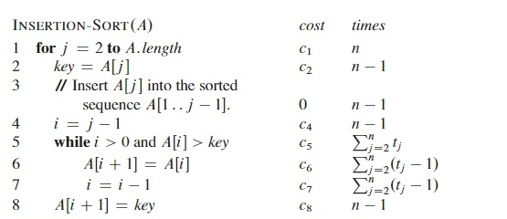
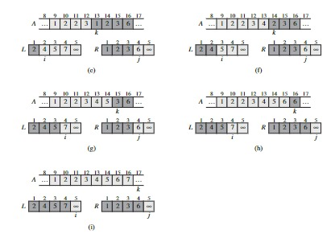

# Analysis_and_Design_of_Algorithms

## Series and sumatorias


## Getting Started 

## INSERTION-SORT(A)

A = [5, 2, 4, 6, 1, 3]

```py
for j = 2 to A.length 
    key = A[j]
    // Insert A[j] into the sorted sequence A[1..j-1].
    i = j - 1
    while i > 0 and A[i] > key
        A[i + 1] = A[i]
        i = i - 1
    A[i + 1] = key
```

# Analyzing algorithms



The running time of the algorithm is the sum of running times for each statement executed.

$T(n)=c_1n+c_2(n-1)+0(n-1)+c_4(n-1)+c_5\sum_{j=2}^nt_j+c_6\sum_{j=2}^n(t_j-1)+c7\sum_{j=2}^n(t_j-1)+c_8(n-1)$


$T(n)=c_1n+c_2(n-1)+c_4(n-1)+c_5(n-1)+c_8(n-1)= (c_{1}+c_{2}+c_{4}+c_{5}+c_{8})n-(c_{2}+c_{4}+c_{5}+c_{8})$

$\sum_{j=2}^n=\frac{n(n+1)}{2}-1$ and $\sum_{j=2}^n(j-1)=\frac{n(n-1)}{2}$

T(n) Final

$T(n)=c_1n+c_2(n-1)+c_4(n-1)+c_5(\frac{n(n+1)}{2}-1)+c_6(\frac{n(n-1)}{2})+c_7(\frac{n(n-1)}{2})+c_8(n-1)$

$=(\frac{c_5}{2}+\frac{c_6}{2}+\frac{c_7}{2})n^2+(c_1+c_2+c_4+\frac{c_5}{2}-\frac{c_6}{2}-\frac{c_7}{2}+c_8)n-(c_2+c_4+c_5+c_8).$


## MERGE(A,p,q,r)



```c++
n1 = q - p + 1
n2 = r - q
let L[1..n1 + 1] and R[1..n2 + 1] be new arrays
for i = 1 to n1
    L[i] = A[p + i - 1]
for j = 1 to n2
    R[j] = A[q + j]
L[n1 + 1] = ∞
R[n2 + 1] = ∞
i = 1
j = 1
for k = p to r
    if L[i] ≤ R[j]
        A[k] = L[i]
        i = i + 1
    else A[k] = R[j]
        j = j + 1
```

# Notation

## $Big\ \ O-notation$

 $O(g(n))=${${f(n) : existen constantes\ \ positivas c, n_{0} \ \ tales que \ \ 0 \leq f(n) \leq c.g(n) \ \ para todo \ \ n\geq n_{0}}$}


# $Big \ \omega notation$
$O(g(n))=${${f(n) : existen constantes\ \ positivas c, n_{0} \ \ tales que \ \ 0 \leq f(n) \leq c.g(n) \ \ para todo \ \ n\geq n_{0}}$}

# $Big \ \theta notation$

# Excercises

Muestre que $\sum_{k=1}^n\frac{1}{k^2}\leq c $ para alguna constante c

$2n = o(n^2)$

# Excercises

$Encontrar una formula simple para \sum_{k=1}^n(2*k-1)$


# Aplicando la primera derivada $\sum_{k=0}^∞kx^{k-1}$


Demostrar que $2n=o(n^2)$

Demostrar que $\sum_{k=1}^n \frac {1}{2k-1}=\ln(\sqrt(n)) + c$, donde c es una constante. Sugerencia: usar la serie armonica.