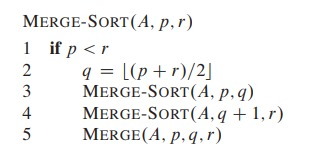
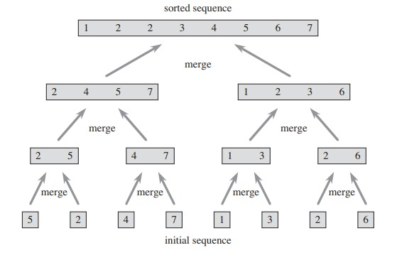

# Divide-and-conquer

| Etapa       | Descripción                                                                                                       |
|-------------|-------------------------------------------------------------------------------------------------------------------|
| **Divide**  | Dividir en subproblemas. (En Merge-sort: Dividir el arreglo de tamaño \( $n$ \) en 2 subsecuencias de tamaño \( $\frac{n}{2}$ \).)  |
| **Conquer** | Conquista los subproblemas resolviéndolos recursivamente. Resolver directamente si el tamaño es pequeño. (En Merge-sort: Ordenar las dos subsecuencias usando Merge-sort.) |
| **Combine** | Combinar las soluciones de los subproblemas en la solución del problema original (En Merge-sort: Mezclar las dos subsecuencias ordenadas)                               |

    
    

# Recurrences & Runing Time Analyze

$
\left\{ \begin{array}{l}
\text{Línea 1} \\
\text{Línea 2} \\
\text{Línea 3}
\end{array} \right\}
$
